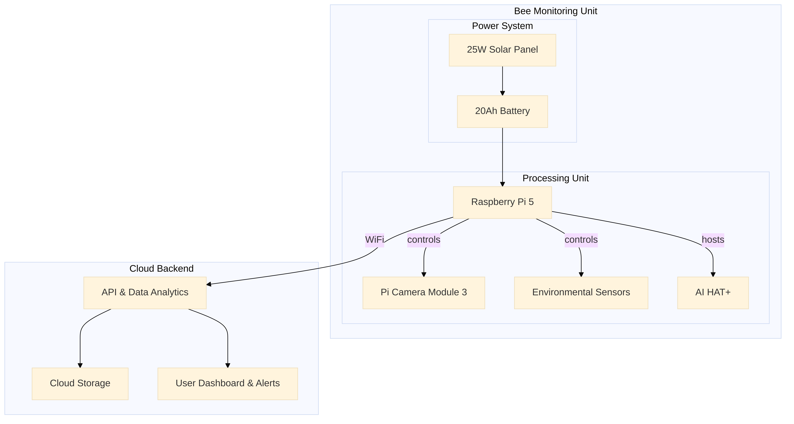

_# System Architecture and Data Flow

This document outlines the system architecture and data flow for the Digital4.ai Bee Monitoring System.

## 1. System Architecture

The system is composed of two main parts: the Bee Monitoring Unit and the Cloud Backend. The following diagram illustrates the high-level architecture:

### 1.1. Bee Monitoring Unit

The Bee Monitoring Unit is a self-contained, solar-powered device responsible for data acquisition and edge processing. It consists of:

*   **Power System:** A 25W solar panel and a 20Ah battery provide continuous power to the unit, with a backup capacity of 2-3 days.
*   **Processing Unit:** A Raspberry Pi 5 with an AI HAT+ (Hailo-8L) serves as the central processing unit. The AI HAT+ provides 13 TOPS of AI inference performance for real-time analysis.
*   **Sensors:** A Pi Camera Module 3 captures high-resolution video, while DHT22 and light sensors collect environmental data (temperature, humidity, and light intensity).

### 1.2. Cloud Backend

The Cloud Backend is responsible for data storage, advanced analytics, and user-facing services. It includes:

*   **Cloud Storage:** Stores historical data, including video clips of critical events and daily summaries.
*   **API & Data Analytics:** A set of APIs for data ingestion and access. The data analytics engine processes the data to generate insights and predictions.
*   **User Dashboard & Alerts:** A web-based dashboard for users to monitor their bee colonies. The alert system sends notifications for critical events.

## 2. Data Flow

The data flows from the Bee Monitoring Unit to the Cloud Backend as follows:

1.  **Data Acquisition:** The camera and environmental sensors on the Bee Monitoring Unit continuously collect data.
2.  **Edge Processing:** The Raspberry Pi 5 and AI HAT+ process the data in real-time. This includes:
    *   **Object Detection:** The YOLOv8n model detects and counts bees at the hive entrance.
    *   **Behavioral Analysis:** A custom CNN classifies bee behavior (e.g., swarming, agitation).
    *   **Health Analysis:** A custom model detects health issues like mite infestations.
3.  **Data Transmission:** The Bee Monitoring Unit connects to the Cloud Backend via WiFi. It transmits:
    *   **Real-time Alerts:** Immediate notifications for critical events.
    *   **Daily Summaries:** Aggregated data and insights from the day's monitoring.
    *   **Video Clips:** Short video clips of significant events.
4.  **Cloud Processing & Storage:** The Cloud Backend receives and stores the data. The data analytics engine performs further analysis to identify long-term trends and generate predictive insights.
5.  **User Interface:** The user can access the data, insights, and alerts through the web-based dashboard.

